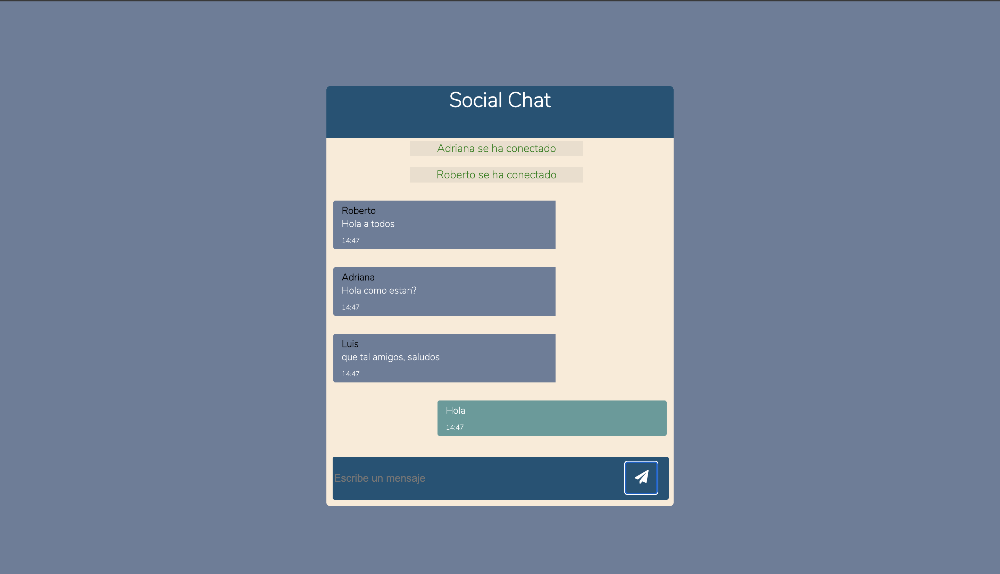

## Chat en tiempo real utlizando nodejs y socket.io, y una web app con react

1. Entra al directorio "server-chat" y ejecuta el siguiente comando:

```
npm install
```

2. Entra al directorio "client-chat" y ejecuta el comando anterior

3. Regresa al directorio "server-chat" y ejecuta el siguiente comando

```
node index
```

4. vuelve al directorio "client-chat" y ejecuta el siguiente comando

```
npm start
```

En tu navegador veras la app lista para utilizar


